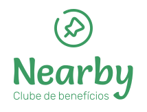
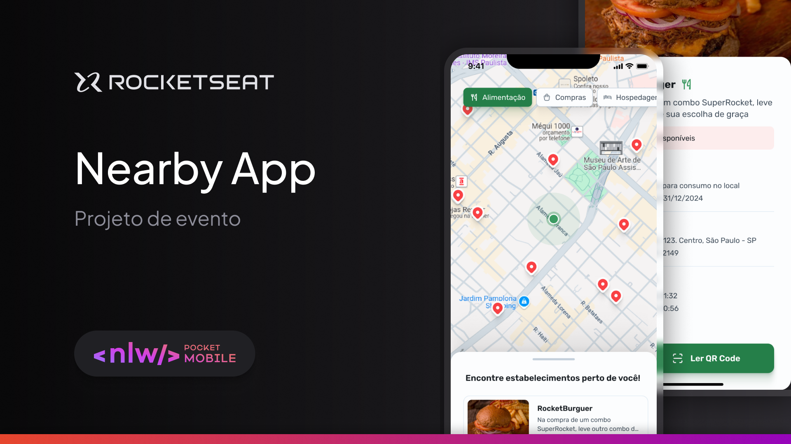

<div align="center">
    
</div>



# 💻 Overview

Nearby is a mobile application that connects users with local businesses through an exclusive benefits club platform. The app allows users to discover and redeem digital coupons at establishments near their location, providing a seamless experience for both customers and business partners.

## 🚀 Features

- [x] 📍 **Location-Based Discovery**: Find deals and establishments near you
- [x] 💸 **Digital Coupons**: Easy-to-use digital coupons for instant savings
- [x] 🏢 **Business Categories**: Browse offers by business categories
- [x] ❤️ **Favorites**: Save your preferred establishments and deals

## 📱 Technologies

### Mobile App (Frontend)

- React Native
- Expo
- React Navigation
- Axios
- AsyncStorage
- React Native Maps
- Expo Location

### Backend

Developed by [orodrigogo](https://github.com/orodrigogo)

- Node.js
- Express
- MongoDB
- Geolocation Services
- RESTful API

## 🛠️ Installation

### Prerequisites

- Node.js (v14 or higher)
- npm or yarn
- Expo CLI
- MongoDB

### Mobile App Setup

```bash
# Clone the repository
git clone https://github.com/KassiaMabily/nearby

# Navigate to the mobile app directory
cd nearby/mobile

# Install dependencies
npm install

# Start the Expo development server
expo start
```

### Backend Setup

```bash
# Navigate to the backend directory
cd nearby/backend

# Install dependencies
npm install

# Start the server
npm start

# Open Prisma Studio
npx prisma studio
```

## 📱 Running on Mobile

1. Download the Expo Go app on your mobile device
2. Scan the QR code from the Expo development server
3. The app will load on your device

## 👥 Authors

<div align="center">
  <small>Kassia Fraga - Dezembro/2024</small>

[](https://www.instagram.com/kassia.mabily/)
[](https://www.linkedin.com/in/kassia-fraga/)

</div>
